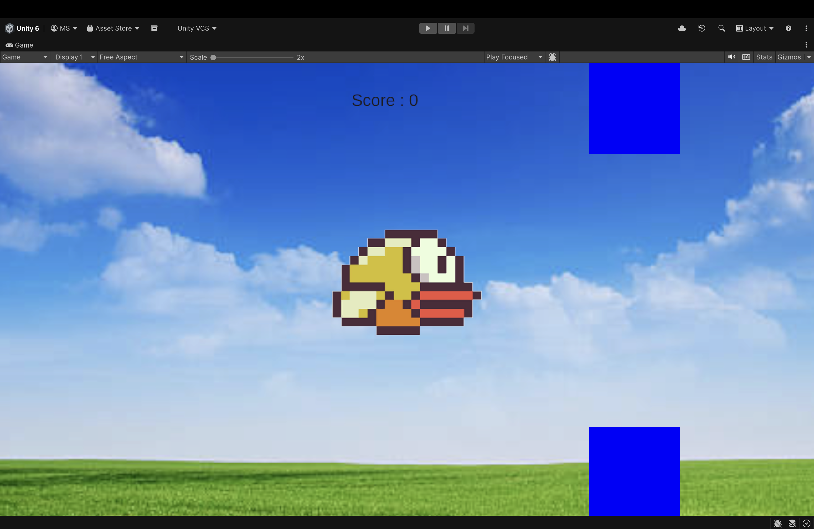
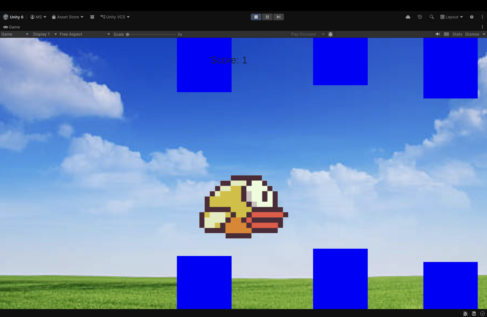

# Flappy-Game-Unity
# 🐤 Flappy Bird Game (Unity)

## About the Project
This is a 2D Flappy Bird-style game developed using Unity as part of the 20 Games Making Challenge.  
The player controls a bird that must fly through continuously spawning pipes without colliding.

---

## Engine Used
- Unity (2D)
- C#

---

## Features
- Bird movement with gravity and jump mechanics  
- Dynamic pipe spawning with adjustable gaps  
- Score system that updates when passing obstacles  
- Collision detection with pipes and ground  
- Game over on collision  

---

## What I Learned
- Working with Rigidbody2D and physics  
- Implementing collision and trigger detection  
- Using prefabs and object spawning  
- Managing UI with TextMeshPro  
- Debugging common Unity issues  

---

## Challenges Faced
- Fixing score not updating correctly  
- Handling prefab vs scene references  
- Pipe spawning inconsistencies  
- GitHub large file errors due to Unity folders  

---

## 🖼️ Screenshots

---

## How to Play
- Press spacebar (or tap) to make the bird jump  
- Avoid hitting pipes or the ground  
- Score increases when passing through pipes  

---

## Submission Details
- Challenge: 20 Games Making Challenge – Game 2  
- Hashtag: #cl-game-dev-2/20games  

---

##  Repository Link

